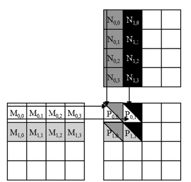

# Parallelizing Matrix Multiplication using GPUs
Tamer Kobba
202104873
# Introduction
Matrix multiplication , is an important component of the Basic Linear Algebra Subprograms standard. It is also an important computation for deep learning using convolutional neural networks.
Matrix multiplication between an I x j (i rows by j columns) matrix M and a
j x k matrix N produces an I x k matrix P. When a matrix multiplication is performed, each element of the output matrix P is an inner product of a row of M and a column of N. To Parallelize matrix multiplication using GPUs we took two approaches using CUDA and OpenACC

# Basic Implementation
The primary logic of distributing the task of matrix multiplication across multiple GPU threads involves mapping each thread to a unique element in the result matrix `P`. Each element of `P` is computed by taking the dot product of a row from matrix `M` and a column from matrix `N`.

## Key Concepts:
- **Matrix Element Calculation**: Each thread computes one element of the output matrix. For the element at position `(row, col)`, the thread calculates the dot product of the `row`-th row of `M` and the `col`-th column of `N`.

- **Thread Assignment**: Threads are organized into a two-dimensional grid of blocks, where each block also contains a two-dimensional arrangement of threads. The `row` and `col` indices for each thread are derived from its position within the block and the block's position within the grid.

- **Execution Blocks**: The grid's dimensions are determined based on the size of the matrices. Blocks are sized to ensure that all elements of the matrix `P` are covered. Commonly, the block size might be `16x16`, meaning each block computes the results for a `16x16` sub-section of `P`.

# Tiled Implementation(Using Shared Memory)

1. **Division into Tiles**: The matrix multiplication is divided into smaller sections or "tiles." This tiling approach allows the matrix to be processed in chunks that fit into the fast, shared memory available on each GPU block.

2. **Shared Memory Allocation**: Each block of threads allocates two slices of shared memory: one for a sub-matrix of `M` (`s_a`) and another for a sub-matrix of `N` (`s_b`). The size of these shared memory arrays is determined by the `SHMEM_SIZE`, which must be large enough to hold an entire tile but small enough to fit within the GPU's shared memory constraints.

3. **Loading Tiles into Shared Memory**:
   - Each thread loads one element of `M` and one element of `N` into shared memory.
   - For matrix `M`, the threads load elements corresponding to their block's current tile position across the dimension of `M`.
   - For matrix `N`, threads load elements that align with the tile's placement in the transposed dimension.

4. **Synchronization**:
   - After loading the tiles into shared memory, threads within a block synchronize using `__syncthreads()`. This ensures all data needed for the computation is loaded before any calculations begin.

5. **Performing Multiplication on Tiles**:
   - Each thread calculates a part of the dot product for the corresponding element in the result matrix `P` using the data from shared memory.
   - It iterates over the width of the tile, multiplying corresponding elements from `s_a` and `s_b` and accumulating the result.

6. **Handling Multiple Tiles**:
   - The entire matrix is not processed in one go if it's larger than the tile size. Instead, the kernel iterates over segments of the matrices, loading new tiles into shared memory iteratively.
   - After processing one set of tiles, threads must synchronize again to prevent any thread from modifying shared memory while others are still reading from it.

This approach effectively reduces the amount of global memory traffic required during matrix multiplication, which is typically a bottleneck in GPU computations due to slower access times compared to shared memory. By using shared memory to store the most frequently accessed elements of `M` and `N`, the kernel minimizes the time spent fetching data, leading to faster execution.

# Github Link
[https://github.com/Tamerkobba/Parallel_Matrix_Mul](https://github.com/Tamerkobba/Parallel_Matrix_Mul)

# Performance
# Sequential
We took the average time after running the program 10 times
Avergae Sequential time =13.71 seconds
# Parallel
I tested a variety of configurations regarding the number of threads per block and the number of blocks per grid:(We assumed `N`=1024)
1. **Small Square Blocks**
   - Threads per Block: 16x16 (256 threads)
   - Blocks per Grid: (N/16, N/16)

2. **Medium Square Blocks**
   - Threads per Block: 32x32 (1024 threads)
   - Blocks per Grid: (N/32, N/32)

3. **High Thread Count Rectangular Blocks**
   - Threads per Block: 32x16 (512 threads)
   - Blocks per Grid: (N/32, N/16)

4. **Wide Rectangular Blocks**
   - Threads per Block: 64x8 (512 threads)
   - Blocks per Grid: (N/64, N/8)

5. **Tall Rectangular Blocks**
   - Threads per Block: 8x64 (512 threads)
   - Blocks per Grid: (N/8, N/64)

6. **Minimal Thread Blocks**
   - Threads per Block: 8x8 (64 threads)
   - Blocks per Grid: (N/8, N/8)

7. **Maximum Threads per Block**
   - Threads per Block: 16x64 (1024 threads, check if supported)
   - Blocks per Grid: (N/16, N/64)

8.  **Varied Aspect Ratio**
    - Threads per Block: 10x10 (100 threads)
    - Blocks per Grid: (N/10, N/10)
Total Threads = Threads per Block * Blocks per Grid (calculated as ThreadsX * ThreadsY * BlocksX * BlocksY)
# Cuda
## Basic
### Speedup factor
| Configuration Name                  | Threads per Block | Blocks per Grid       | Total Threads | Speed-Up Factor |
|-------------------------------------|-------------------|-----------------------|---------------|-----------------|
| Small Square Blocks                 | 16x16 (256 threads)| (64, 64)              | 65536         |   1499.67      |
| Varied Aspect Ratio                 | 10x10 (100 threads)| (103, 103)            | 106090        |    845.77      |
| Minimal Thread Blocks               | 8x8 (64 threads)  | (128, 128)            | 131072        |         942.39  |
| High Thread Count Rectangular Blocks| 32x16 (512 threads) | (32, 64)             | 131072        |     1991.574666            |
| Wide Rectangular Blocks             | 64x8 (512 threads) | (16, 128)             | 131072        |        2035.93         |
| Tall Rectangular Blocks             | 8x64 (512 threads) | (128, 16)             | 131072        |       957.736          |
| Medium Square Blocks                | 32x32 (1024 threads)| (32, 32)             | 1048576       |   2059.17693              |                |
| Maximum Threads per Block           | 16x64 (1024 threads)| (64, 16)             | 1048576       |      1528.768956           |

### Efficiency
| Configuration Name                  | Threads per Block | Blocks per Grid       | Total Threads | Efficiency Measurement |
|-------------------------------------|-------------------|-----------------------|---------------|------------------------|
| Small Square Blocks                 | 16x16 (256 threads)| (64, 64)              | 65536         |    0.2288                    |
| Varied Aspect Ratio                 | 10x10 (100 threads)| (103, 103)            | 106090        |          7.97x10^-3              |
| Minimal Thread Blocks               | 8x8 (64 threads)  | (128, 128)            | 131072        |      7.18x10^-3                  |
| High Thread Count Rectangular Blocks| 32x16 (512 threads) | (32, 64)             | 131072        |           0.015194             |
| Wide Rectangular Blocks             | 64x8 (512 threads) | (16, 128)             | 131072        |          0.0155239              |
| Tall Rectangular Blocks             | 8x64 (512 threads) | (128, 16)             | 131072        |                   7.3069x10^-3     |
| Medium Square Blocks                | 32x32 (1024 threads)| (32, 32)             | 1048576       |   1.963x10^-3                     |
| Maximum Threads per Block           | 16x64 (1024 threads)| (64, 16)             | 1048576       |           1.45794x10^-3             |

### Scalability

## Tiled
### Speedup factor
| Configuration Name                  | Threads per Block | Blocks per Grid       | Total Threads | Speed-Up Factor |
|-------------------------------------|-------------------|-----------------------|---------------|-----------------|
| Small Square Blocks                 | 16x16 (256 threads)| (64, 64)              | 65536         |     1849.453            |
| Varied Aspect Ratio                 | 10x10 (100 threads)| (103, 103)            | 106090        |     `RESULTED IN MATRIX OF ZEROS`            |
| Minimal Thread Blocks               | 8x8 (64 threads)  | (128, 128)            | 131072        |   1259.18              |
| High Thread Count Rectangular Blocks| 32x16 (512 threads) | (32, 64)             | 131072        |   2083.122946              |
| Wide Rectangular Blocks             | 64x8 (512 threads) | (16, 128)             | 131072        | `RESULTED IN MATRIX OF ZEROS`                |
| Tall Rectangular Blocks             | 8x64 (512 threads) | (128, 16)             | 131072        |     1329.132332            |
| Medium Square Blocks                | 32x32 (1024 threads)| (32, 32)             | 1048576       |     1930.713984            |
| Maximum Threads per Block           | 16x64 (1024 threads)| (64, 16)             | 1048576       |     1668.086142            |

### Efficiency
| Configuration Name                  | Threads per Block | Blocks per Grid       | Total Threads | Efficiency Measurement |
|-------------------------------------|-------------------|-----------------------|---------------|------------------------|
| Small Square Blocks                 | 16x16 (256 threads)| (64, 64)              | 65536         |    0.02822                    |
| Varied Aspect Ratio                 | 10x10 (100 threads)| (103, 103)            | 106090        |   `RESULTED IN MATRIX OF ZEROS`                     |
| Minimal Thread Blocks               | 8x8 (64 threads)  | (128, 128)            | 131072        |       9.606x10^-3                 |
| High Thread Count Rectangular Blocks| 32x16 (512 threads) | (32, 64)             | 131072        |                 0.01589       |
| Wide Rectangular Blocks             | 64x8 (512 threads) | (16, 128)             | 131072        |   `RESULTED IN MATRIX OF ZEROS`                      |
| Tall Rectangular Blocks             | 8x64 (512 threads) | (128, 16)             | 131072        |          0.0101             |
| Medium Square Blocks                | 32x32 (1024 threads)| (32, 32)             | 1048576       |            1.86X106x10^-3            |
| Maximum Threads per Block           | 16x64 (1024 threads)| (64, 16)             | 1048576       |              1.59081x10^-3          |

### Scalability
# OpenACC
## Basic
### Speedup factor
| Configuration Name                  | Threads per Block | Blocks per Grid       | Total Threads | Speed-Up Factor |
|-------------------------------------|-------------------|-----------------------|---------------|-----------------|
| Small Square Blocks                 | 16x16 (256 threads)| (64, 64)              | 65536         |                 |
| Varied Aspect Ratio                 | 10x10 (100 threads)| (103, 103)            | 106090        |                 |
| Minimal Thread Blocks               | 8x8 (64 threads)  | (128, 128)            | 131072        |                 |
| High Thread Count Rectangular Blocks| 32x16 (512 threads) | (32, 64)             | 131072        |                 |
| Wide Rectangular Blocks             | 64x8 (512 threads) | (16, 128)             | 131072        |                 |
| Tall Rectangular Blocks             | 8x64 (512 threads) | (128, 16)             | 131072        |                 |
| Medium Square Blocks                | 32x32 (1024 threads)| (32, 32)             | 1048576       |                 |
| Maximum Threads per Block           | 16x64 (1024 threads)| (64, 16)             | 1048576       |                 |

### Efficiency
| Configuration Name                  | Threads per Block | Blocks per Grid       | Total Threads | Efficiency Measurement |
|-------------------------------------|-------------------|-----------------------|---------------|------------------------|
| Small Square Blocks                 | 16x16 (256 threads)| (64, 64)              | 65536         |                        |
| Varied Aspect Ratio                 | 10x10 (100 threads)| (103, 103)            | 106090        |                        |
| Minimal Thread Blocks               | 8x8 (64 threads)  | (128, 128)            | 131072        |                        |
| High Thread Count Rectangular Blocks| 32x16 (512 threads) | (32, 64)             | 131072        |                        |
| Wide Rectangular Blocks             | 64x8 (512 threads) | (16, 128)             | 131072        |                        |
| Tall Rectangular Blocks             | 8x64 (512 threads) | (128, 16)             | 131072        |                        |
| Medium Square Blocks                | 32x32 (1024 threads)| (32, 32)             | 1048576       |                        |
| Maximum Threads per Block           | 16x64 (1024 threads)| (64, 16)             | 1048576       |                        |

### Scalability
## Tiled
### Speedup factor
| Configuration Name                  | Threads per Block | Blocks per Grid       | Total Threads | Speed-Up Factor |
|-------------------------------------|-------------------|-----------------------|---------------|-----------------|
| Small Square Blocks                 | 16x16 (256 threads)| (64, 64)              | 65536         |                 |
| Varied Aspect Ratio                 | 10x10 (100 threads)| (103, 103)            | 106090        |                 |
| Minimal Thread Blocks               | 8x8 (64 threads)  | (128, 128)            | 131072        |                 |
| High Thread Count Rectangular Blocks| 32x16 (512 threads) | (32, 64)             | 131072        |                 |
| Wide Rectangular Blocks             | 64x8 (512 threads) | (16, 128)             | 131072        |                 |
| Tall Rectangular Blocks             | 8x64 (512 threads) | (128, 16)             | 131072        |                 |
| Medium Square Blocks                | 32x32 (1024 threads)| (32, 32)             | 1048576       |                 |
| Maximum Threads per Block           | 16x64 (1024 threads)| (64, 16)             | 1048576       |                 |

### Efficiency
| Configuration Name                  | Threads per Block | Blocks per Grid       | Total Threads | Efficiency Measurement |
|-------------------------------------|-------------------|-----------------------|---------------|------------------------|
| Small Square Blocks                 | 16x16 (256 threads)| (64, 64)              | 65536         |                        |
| Varied Aspect Ratio                 | 10x10 (100 threads)| (103, 103)            | 106090        |                        |
| Minimal Thread Blocks               | 8x8 (64 threads)  | (128, 128)            | 131072        |                        |
| High Thread Count Rectangular Blocks| 32x16 (512 threads) | (32, 64)             | 131072        |                        |
| Wide Rectangular Blocks             | 64x8 (512 threads) | (16, 128)             | 131072        |                        |
| Tall Rectangular Blocks             | 8x64 (512 threads) | (128, 16)             | 131072        |                        |
| Medium Square Blocks                | 32x32 (1024 threads)| (32, 32)             | 1048576       |                        |
| Maximum Threads per Block           | 16x64 (1024 threads)| (64, 16)             | 1048576       |                        |

### Scalability